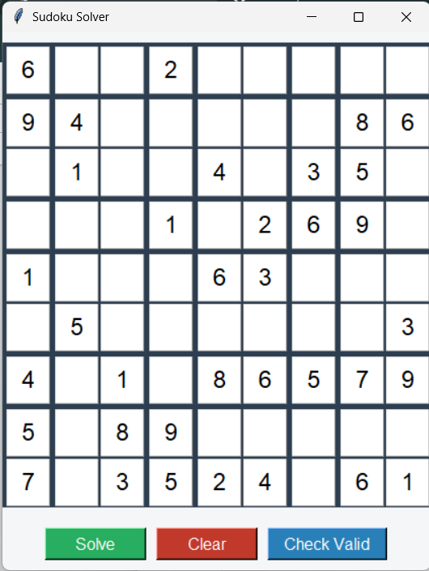
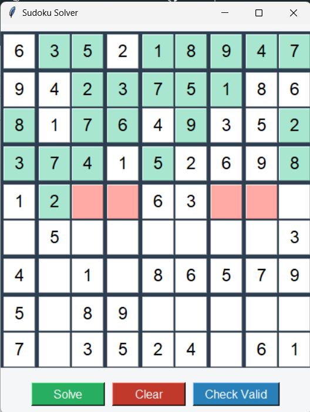
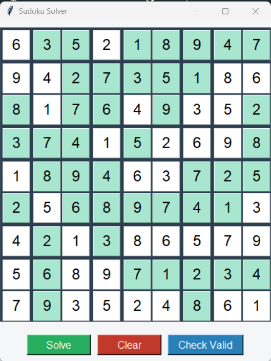
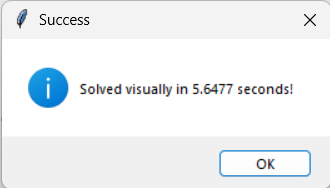
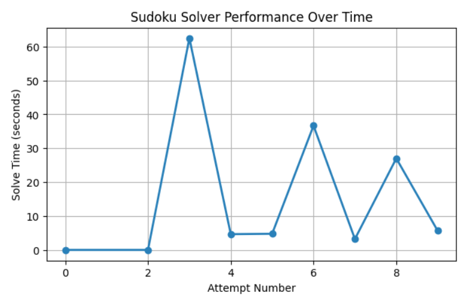

# Sudoku Solver with Visual Backtracking and Performance Analysis

Sudoku solving is a process of exploration, not guesswork. Behind every completed grid lies a sequence of decisions, validations, and backtracking steps.

This project exposes that process by visually demonstrating how a computer solves Sudoku using recursion and backtracking. Built with Python and Tkinter, it allows users to input puzzles, watch each solving step in real time, and analyze performance through timed execution and graphical insights.

---

## Project Overview

This application is a desktop-based Sudoku Solver that combines:
- Algorithmic problem solving
- Graphical visualization
- Performance tracking and analysis

The solver uses a recursive backtracking algorithm and visually highlights each placement and backtracking step, making it ideal for understanding how constraint-based search algorithms work in practice.

---

## Folder Structure
<pre>
SUDOKU SOLVER/
│
├── images/
│ ├── initial_board.png
│ ├── intermediate_board.png
│ ├── solved_sudoku.png
│ ├── success_message.png
│ └── time_complexity_for_levels.png
│
├── sudoku_solver_code.ipynb
└── README.md
</pre>

---

## Visual Walkthrough

### Initial Puzzle Input
Users can manually enter a Sudoku puzzle into the 9×9 grid. Input is restricted to digits 1–9 to ensure validity.

---

### Solving in Progress (Backtracking Visualization)
As the solver runs, each number placement is highlighted. When a conflict occurs, the algorithm backtracks and visually removes the incorrect value, clearly demonstrating recursive decision-making.

---

### Successfully Solved Puzzle
Once a valid solution is found, the completed Sudoku grid is displayed along with the total time taken to solve the puzzle.

---

## Key Features

- Interactive 9×9 Sudoku input grid
- Real-time visualization of the backtracking algorithm
- Color-based indication of forward steps and backtracking
- Solve-time measurement for each attempt
- Persistent CSV logging of performance data
- Live performance graph using Matplotlib
- Board validation before solving
- Clear/reset grid functionality

---

## Algorithm Explanation

### Backtracking Strategy

1. Scan the grid to find the first empty cell
2. Try numbers from 1 to 9
3. Validate each number using Sudoku constraints:
   - Row uniqueness
   - Column uniqueness
   - 3×3 subgrid uniqueness
4. If valid, place the number and recurse
5. If no valid number works, backtrack by resetting the cell
6. Continue until the board is solved or proven unsolvable

Each of these steps is visualized in the GUI for clarity.

---

## Performance Tracking and Analysis

- Each solve attempt is timed automatically
- Solve times are stored in a CSV file
- A live graph plots attempt number versus solve time
- This allows analysis of solver efficiency and consistency

---

## Technologies Used

- Python 3
- Tkinter for GUI development
- Matplotlib for graphical analysis
- CSV for data logging
- OS module for file handling

---

## Team Collaborators
Tapasya Patel
Varun Patel
